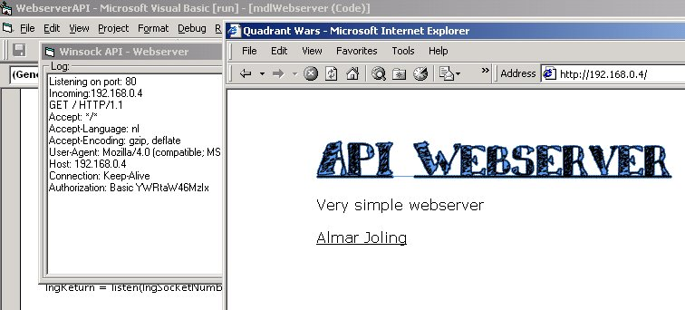



## Winsock API Webserver

### Description

Very unique code. This is the only Webserver on the internet that uses the Winsock api (and where the source code is downloadable!) I needed a simple webserver without the Winsock OCX for my game's server, for some easy remote-admin. That's why this code also has the Basic Authenticationscheme implented. The code is a bit messy, but it's been tough to get it working anyways. I hope you people enjoy this code and that you may learn something from it (That's why I put it online :)

-Supports images

-Checks if pages exists (does not return 404 though)

-Has Basic Authentication functionality (run it and you'll see it)

-Pretty secure I believe ("/../" won't work)

-Accepts multiple connections!

One drawback: The events are based on two command buttons. Yes, I'm sorry. but I just don't like AddressOfs, hooks, callbacks and whatever... they just are too crashy when you're beginning with something like this...

I used someones 2 class modules found on this site... I forgot the author of it. if anyone knows it, let me kow. Credit where credit is due :)

Anyway, enjoy!
 
### More Info
 
Basic knowledge of the HTTP1.0/1.1 protocol, and how to connect to a local webserver (enter 127.0.0.1)

A freshly server HTML page

Using Winsock API is sometimes a very delicate job... be carefull what you change

             |
---                |---
**Submitted On**   |2001-11-17 14:15:30
**By**             |[Almar Joling](https://github.com/Planet-Source-Code/PSCIndex/blob/master/ByAuthor/almar-joling.md)
**Level**          |Advanced
**User Rating**    |4.5 (50 globes from 11 users)
**Compatibility**  |VB 5\.0, VB 6\.0
**Category**       |[Internet/ HTML](https://github.com/Planet-Source-Code/PSCIndex/blob/master/ByCategory/internet-html__1-34.md)
**World**          |[Visual Basic](https://github.com/Planet-Source-Code/PSCIndex/blob/master/ByWorld/visual-basic.md)
**Archive File**   |[Winsock\_AP3573111172001\.zip](https://github.com/Planet-Source-Code/almar-joling-winsock-api-webserver__1-28960/archive/master.zip)

### API Declarations

38kb of Winsock declarations =-)

